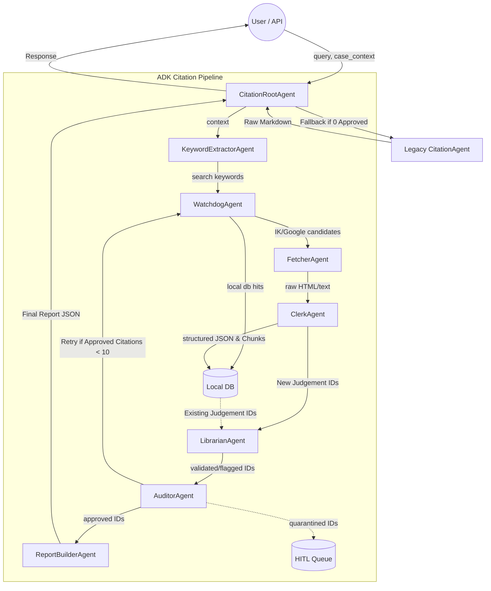

# Citation Service Agents Overview

The `citation-service` utilizes an ADK-compatible multi-agent orchestration architecture to handle complex legal research, document retrieval, and citation verification. 

There are **8 primary agents** operating in the main pipeline orchestrated by the Root Agent, plus **2 helper/fallback agents**. This makes a total of **10 agents**.

## 1. List of Agents & Their Detailed Functions

### 1. CitationRootAgent (`agents/root_agent.py`)
- **Function**: The central orchestrator that manages the state (`AgentContext`) and delegates execution to all other sub-agents in a sequential pipeline.
- **Role**: Validates initial user requests, triggers fallback mechanisms if needed, handles looping (e.g., retrying the search if the auditor rejects too many citations), and logs the step-by-step progress to the database.

### 2. KeywordExtractorAgent (`agents/root_agent.py`)
- **Function**: AI-driven keyword engine. Uses a LLM (Gemini/Claude) to analyze user queries and long case file contexts.
- **Role**: Generates a set of structured, 3-layer search keywords (Statute + Doctrine/Fact + Court/Time) optimized for querying Indian Kanoon and Google Serper.

### 3. WatchdogAgent (`agents/root_agent.py` & `agents/watchdog.py`)
- **Function**: The primary discovery and search agent.
- **Role**: Takes the structured search keywords and simultaneously searches three sources:
  1. **Local DB**: Returns existing judgements.
  2. **Indian Kanoon API**: Returns candidate citations (TIDs).
  3. **Google Serper**: Acts as a fallback for web-based hits.
- **Output**: A merged, ranked list of candidate document IDs and URLs.

### 4. FetcherAgent (`agents/root_agent.py` & `agents/fetcher.py`)
- **Function**: The retrieval agent.
- **Role**: Downloads the full raw text or HTML of the candidates identified by the Watchdog. Runs parallel fetching from the Indian Kanoon API and Google web URLs. Parses out basic text while dropping extraneous HTML/CSS.

### 5. ClerkAgent (`agents/root_agent.py` & `agents/clerk.py`)
- **Function**: The OCR, structuring, and embedding agent.
- **Role**: Uses Gemini 2.0 Flash to extract 10 exact predefined mandatory data points (e.g., *caseName, primaryCitation, ratio, court, dateOfJudgment, benchmark excerpt*) from the raw text. It also chunks the document and stores it into the Vector/Local Database for future semantic search retrieval.

### 6. LibrarianAgent (`agents/root_agent.py` & `agents/librarian.py`)
- **Function**: The metadata validation and enrichment agent.
- **Role**: Validates citation formatting (e.g., checking for valid SCC, AIR patterns), verifies plausible years and court names, detects the Area of Law (e.g., Criminal, Corporate, Constitutional), and checks content quality. It categorizes citations into `validated`, `flagged`, or `rejected`.

### 7. AuditorAgent (`agents/root_agent.py` & `agents/auditor.py`)
- **Function**: The final zero-mistake verification gatekeeper.
- **Role**: Conducts a cross-check of everything the Librarian flagged. Verifies local data integrity, cross-checks against Indian Kanoon directly, and runs heuristic "hallucination checks" (e.g., future dates, suspicious placeholder text). 
- **Output**: Grants the `VERIFIED` status or relegates citations to `QUARANTINED` (hidden from the user/pushed to a HITL queue).

### 8. ReportBuilderAgent (`agents/root_agent.py`)
- **Function**: The presentation compiler.
- **Role**: Takes the final `approved_ids` from the AuditorAgent and assembles a finalized Verification Report containing the citations, audit trails, and human-in-the-loop pending items.

### 9. LegalCitationAgent (`agents/legal_citation_agent.py`)
- **Function**: Data ingestion helper for the ClerkAgent.
- **Role**: Specialized agent that interacts with the database (Qdrant & PostgreSQL) to securely insert structural fields and semantically embed chunks. It is invoked internally by the `ClerkAgent` during ingestion.

### 10. Legacy CitationAgent (`citation_agent.py`)
- **Function**: A standalone fallback agent.
- **Role**: Used entirely as a fallback. If the ADK pipeline yields no external candidates or the auditor quarantines every single retrieval, this agent uses basic Serper results and Gemini API to generate a raw markdown report without complex database ingestion.

### Note on "Citation Agents" naming
There are three distinct agents that share the "Citation Agent" naming convention:
- **`CitationRootAgent`** (`agents/root_agent.py`): The main orchestrator for the entire multi-agent pipeline.
- **`LegalCitationAgent`** (`agents/legal_citation_agent.py`): The specialized data-ingestion helper for the database.
- **Legacy Citation Agent** (`citation_agent.py`): The older, single-shot fallback agent used as a last resort.

---

## 2. Data Flow & Agent Interactions

The data moves systematically through the agents. Below is the step-by-step logic:

1. **Initialization**: The `CitationRootAgent` receives a `query` and optionally `case_file_context`.
2. **Contextual Expansion**: `KeywordExtractorAgent` looks at the case files + query and emits a list of optimized `keyword_sets`.
3. **Candidate Discovery**: `WatchdogAgent` takes those `keyword_sets`, queries external APIs/Local DB, and returns `candidates` (lists of TIDs / URLs).
4. **Data Retrieval**: `FetcherAgent` parallel-downloads the documents for those `candidates` and outputs `raw_content`.
5. **Ingestion & Structuring**: `ClerkAgent` processes `raw_content` with LLMs to yield structured legal fields, chunk embeddings, and inserts them into the DB (`judgement_ids`).
6. **Data Cleaning**: `LibrarianAgent` runs Regex and heuristic checks on the DB row metadata to yield `validated_ids` and `flagged_ids`.
7. **Strict Cross-Validation**: `AuditorAgent` scrutinizes the `validated/flagged_ids`. 
   - *If the number of approved citations falls below the target (10)*, the `AuditorAgent` tells the `CitationRootAgent` to retry. The Root loops back to the `WatchdogAgent` to fetch more.
   - Outputs a final list of `approved_ids`.
8. **Assembling**: `ReportBuilderAgent` turns the `approved_ids` into the final UI-ready `report_format`.

---

## 3. Flow Diagram

