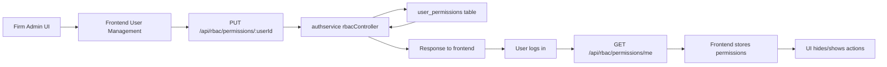
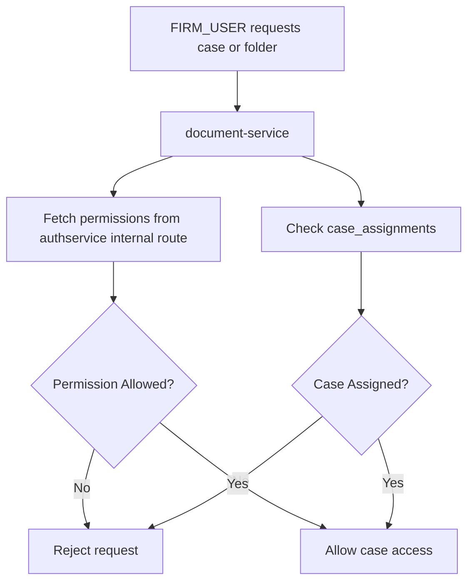
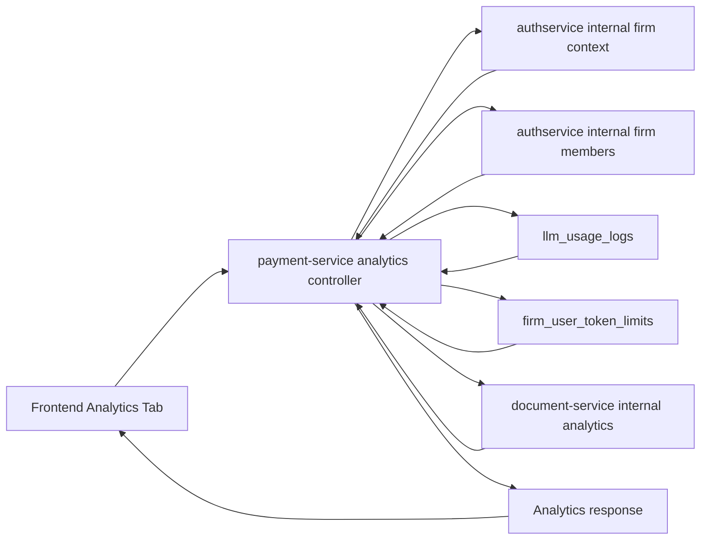

# RBAC Documentation

## 1. Purpose

This document explains how Role Based Access Control (RBAC) is implemented in this project.

It covers:

- how permissions are stored
- how case access is controlled
- which backend and frontend files implement the logic
- which database tables are used
- which API endpoints are involved
- how inherited firm plans and token caps work
- what changed in the codebase to support the current RBAC flow

This document is written in simple words, but it is detailed enough for developers to trace the complete flow.

---

## 2. High-Level Summary

The RBAC system is split across three backend services and one frontend application:

- `authservice`
  Stores user permissions, firm membership, user activity timestamps, and firm-user lifecycle actions.

- `document-service`
  Enforces case access, folder visibility, case assignment, internal document analytics, and folder-chat token-cap enforcement.

- `payment-service`
  Resolves effective plans, stores token usage logs, stores firm-user token caps, and powers the analytics dashboard.

- `frontend`
  Fetches permissions and analytics data, hides or shows UI based on RBAC, and provides the User Management + Analytics experience.

Important design rule:

- the frontend improves user experience by hiding buttons and pages
- the backend is still the final source of truth and blocks unauthorized actions

So the system is secure even if someone manually calls an API.

---

## 3. Main RBAC Concepts

### 3.1 Account types

The system mainly works with these account types:

- `SOLO`
- `FIRM_ADMIN`
- `FIRM_USER`

### 3.2 Permission storage

Granular permissions are stored per user in the `user_permissions` table as JSONB.

Example:

```json
{
  "create_new_users": "Allowed",
  "manage_user_permissions": "Allowed",
  "view_case_information": "Disabled",
  "create_new_cases": "Allowed"
}
```

### 3.3 Case access storage

Case assignment is stored separately from normal permissions.

That means:

- normal permission says what type of action the user may do
- case assignment says which specific case the user may access

Case assignment is stored in `case_assignments`.

### 3.4 Inherited firm plan

If a `FIRM_USER` has no direct paid subscription, the system resolves the firm admin and uses the admin's active plan as the effective plan for that user.

So:

- `FIRM_ADMIN` can have a direct plan
- `FIRM_USER` can inherit that plan automatically

### 3.5 Per-user token cap

Even when a firm user inherits the firm plan, the firm admin can set a monthly token cap for that specific user.

If the cap is exceeded and hard stop is enabled:

- token-consuming requests are blocked
- the user gets a message telling them to contact the firm admin

---

## 4. System Flow In Simple Words

### 4.1 Permission flow

1. Firm admin opens User Management.
2. Admin edits a user's permission matrix.
3. Frontend sends the updated permissions to authservice.
4. Authservice stores them in `user_permissions`.
5. When the user logs in, frontend fetches `permissions/me`.
6. Frontend updates the UI based on those permissions.
7. Backend checks permissions again when sensitive APIs are called.

### 4.2 Case access flow

For a `FIRM_USER`, seeing or using a case depends on two things:

1. The user must have the required permission like `view_case_information`.
2. The case must be assigned to that user in `case_assignments`.

So for a firm user:

- permission alone is not enough
- assignment alone is not enough
- both must allow access

### 4.3 Analytics flow

1. Firm admin opens the Analytics tab in User Management.
2. Frontend calls payment-service analytics endpoints.
3. Payment-service gets:
   - firm context and firm members from authservice
   - token usage from `llm_usage_logs`
   - document and case metrics from document-service internal analytics
   - token cap values from `firm_user_token_limits`
4. Payment-service combines the data and returns analytics rows.
5. Frontend renders the dashboard and user detail pages.

### 4.4 Heartbeat and live status flow

1. After login, frontend starts a heartbeat from `AuthContext`.
2. Every 15 seconds, frontend calls `POST /api/auth/activity/ping`.
3. Authservice updates `last_seen_at`.
4. Analytics uses `last_seen_at` to decide if a member is live.

### 4.5 Token cap enforcement flow

1. Firm admin sets monthly token cap for a firm user.
2. Cap is stored in payment-service.
3. When the firm user tries folder-chat or other token-consuming actions, document-service checks the cap with payment-service before continuing.
4. If cap is exceeded, the request is blocked before continuing to the expensive LLM path.

---

## 5. Dataflow Diagrams

### 5.1 Permission management flow



### 5.2 Case access flow



### 5.3 Analytics flow



---

## 6. Database Tables Used

## 6.1 Authservice database

### `users`

Used for:

- login identity
- `account_type`
- `first_login`
- `is_blocked`
- `created_at`
- `last_login_at`
- `last_seen_at`

Used by:

- auth flow
- firm membership resolution
- analytics live status

Main related files:

- `Backend/authservice/src/models/User.js`
- `Backend/authservice/src/controllers/authController.js`
- `Backend/authservice/src/utils/userActivityDb.js`

### `firms`

Used for:

- identifying the firm
- identifying the real firm admin through `admin_user_id`

Main related files:

- `Backend/authservice/src/models/Firm.js`
- `Backend/authservice/src/routes/internalRoutes.js`
- `Backend/authservice/src/Rbac_service/rbacUtils.js`

### `firm_users`

Used for:

- mapping firm members to a firm
- identifying firm roster and same-firm checks

Main related files:

- `Backend/authservice/src/models/FirmUser.js`
- `Backend/authservice/src/routes/internalRoutes.js`
- `Backend/authservice/src/Rbac_service/rbacController.js`
- `Backend/authservice/src/Rbac_service/rbacUtils.js`

### `user_permissions`

Used for:

- storing granular user permission JSON

Columns used:

- `user_id`
- `permissions`
- `created_at`
- `updated_at`

Main related files:

- `Backend/authservice/src/Rbac_service/rbacDb.js`
- `Backend/authservice/src/Rbac_service/rbacController.js`
- `Backend/authservice/src/Rbac_service/rbacUtils.js`

## 6.2 Document-service database

### `cases`

Used for:

- case ownership
- case metadata
- case access decisions
- case analytics

Main related files:

- `Backend/document-service/controllers/FileController.js`
- `Backend/document-service/utils/caseAssignmentsDb.js`

### `user_files`

Used for:

- folders and files
- projects listing
- case document counting
- latest upload and storage analytics

Main related files:

- `Backend/document-service/controllers/FileController.js`

### `case_assignments`

Used for:

- mapping which case is assigned to which user

Columns used:

- `case_id`
- `user_id`
- `assigned_by`
- `created_at`

Main related files:

- `Backend/document-service/utils/caseAssignmentsDb.js`
- `Backend/document-service/controllers/FileController.js`

### `folder_chats`, `custom_query`, related folder AI tables

Used indirectly for:

- folder chat
- selected LLM model
- streaming usage path

Main related files:

- `Backend/document-service/controllers/intelligentFolderChatController.js`
- `Backend/document-service/services/folderAiService.js`

## 6.3 Payment-service database

### `subscription_plans`

Used for:

- plan metadata
- token limits for direct plan logic

Main related files:

- `Backend/payment-service/src/controllers/userResourcesController.js`
- `Backend/payment-service/src/services/effectivePlanService.js`

### `user_subscriptions`

Used for:

- active direct user subscription
- inherited plan resolution input

Main related files:

- `Backend/payment-service/src/controllers/userResourcesController.js`
- `Backend/payment-service/src/services/effectivePlanService.js`

### `llm_usage_logs`

Used for:

- total input tokens
- total output tokens
- total tokens
- total cost
- request counts
- model and endpoint analytics

This is the source of truth for token analytics.

Main related files:

- `Backend/payment-service/src/services/llmUsageLogService.js`
- `Backend/payment-service/src/controllers/llmUsageLogController.js`
- `Backend/payment-service/src/controllers/userResourcesController.js`
- `Backend/payment-service/src/controllers/firmAnalyticsController.js`

### `firm_user_token_limits`

Used for:

- optional per-user monthly token cap inside a firm

Columns used:

- `firm_id`
- `user_id`
- `monthly_token_limit`
- `hard_stop_enabled`
- `updated_by`
- `created_at`
- `updated_at`

Main related files:

- `Backend/payment-service/src/utils/firmAnalyticsDb.js`
- `Backend/payment-service/src/controllers/firmAnalyticsController.js`

---

## 7. Backend File Map And Responsibility

## 7.1 Authservice

### `Backend/authservice/src/Rbac_service/rbacDb.js`

Work:

- creates and maintains `user_permissions`
- ensures RBAC permission storage exists

### `Backend/authservice/src/Rbac_service/rbacUtils.js`

Work:

- defines permission keys and helper checks
- reads permissions from `user_permissions`
- decides whether a user can manage firm users, permissions, resend invite mail, delete firm users, etc.

### `Backend/authservice/src/Rbac_service/rbacController.js`

Work:

- create firm user
- get firm users
- resend password-setup email
- delete firm user
- get current user permissions
- get another user's permissions
- update another user's permissions

This is the main RBAC controller for firm-user lifecycle and permission storage.

### `Backend/authservice/src/Rbac_service/rbacRoutes.js`

Work:

- exposes the public RBAC endpoints used by the frontend

### `Backend/authservice/src/routes/internalRoutes.js`

Work:

- provides internal service-to-service RBAC data
- resolves firm context
- returns firm member ids
- returns full firm members list
- returns permissions for a user

This file is critical for:

- document-service permission checks
- payment-service analytics and inherited plan logic

### `Backend/authservice/src/utils/userActivityDb.js`

Work:

- ensures `last_login_at` and `last_seen_at` columns exist on `users`
- adds indexes for activity lookup

### `Backend/authservice/src/controllers/authController.js`

Work:

- updates login/seen timestamps
- handles `POST /api/auth/activity/ping`

### `Backend/authservice/src/models/User.js`

Work:

- user lookup
- user activity timestamp updates
- shared user data access for RBAC and auth flows

## 7.2 Document-service

### `Backend/document-service/utils/caseAssignmentsDb.js`

Work:

- dynamically creates and validates `case_assignments`
- adapts to real DB types for `cases.id` and local `user_id`
- self-heals the schema if needed

### `Backend/document-service/controllers/FileController.js`

Work:

- main case access enforcement
- case create, update, delete, get
- folder/project visibility
- assignable cases listing
- get/update user case assignments
- internal analytics for uploads, created cases, assigned cases

This is the core file for case access logic.

### `Backend/document-service/routes/fileRoutes.js`

Work:

- exposes case, folder, assignment, upload, and internal analytics routes

### `Backend/document-service/services/tokenUsageService.js`

Work:

- checks token caps through payment-service
- blocks firm users when token quota is exceeded

### `Backend/document-service/middleware/checkTokenLimits.js`

Work:

- upload/token related gating middleware where applicable

### `Backend/document-service/controllers/intelligentFolderChatController.js`

Work:

- folder chat stream/controller entry
- calls token cap enforcement before the expensive LLM path

### `Backend/document-service/services/folderAiService.js`

Work:

- folder AI logic
- streaming usage metadata
- usage log integration after streamed folder chat

### `Backend/document-service/services/llmUsageLogService.js`

Work:

- posts usage logs to payment-service

### `Backend/document-service/index.js`

Work:

- global middleware and error handling
- Multer error handling
- service startup wiring

## 7.3 Payment-service

### `Backend/payment-service/src/utils/firmAnalyticsDb.js`

Work:

- creates and migrates `firm_user_token_limits`
- ensures `firm_id` works with UUID/text firm ids

### `Backend/payment-service/src/services/effectivePlanService.js`

Work:

- resolves the effective plan for a user
- direct plan first
- inherited firm-admin plan second

### `Backend/payment-service/src/services/firmContextService.js`

Work:

- fetches firm context and firm members from authservice internal APIs

### `Backend/payment-service/src/services/documentAnalyticsService.js`

Work:

- fetches document/case analytics from document-service internal API

### `Backend/payment-service/src/services/llmUsageLogService.js`

Work:

- inserts and aggregates rows in `llm_usage_logs`

### `Backend/payment-service/src/controllers/llmUsageLogController.js`

Work:

- internal endpoint that receives usage log writes

### `Backend/payment-service/src/controllers/userResourcesController.js`

Work:

- returns plan details
- returns user plan details
- uses `resolveEffectivePlan`

### `Backend/payment-service/src/controllers/firmAnalyticsController.js`

Work:

- firm analytics summary
- firm analytics user list
- firm analytics user detail
- update user token cap
- internal token cap check

This is the main analytics orchestrator.

### `Backend/payment-service/src/routes/userResourcesRoutes.js`

Work:

- exposes plan, token usage, analytics, cap, and internal cap-check endpoints

---

## 8. Frontend File Map And Responsibility

### `frontend/src/context/AuthContext.jsx`

Work:

- fetches current permissions from authservice
- fetches plan details from payment-service
- stores current permission/plan state in memory
- sends heartbeat every 15 seconds for live presence

### `frontend/src/utils/permissions.js`

Work:

- central permission keys
- shared frontend helper checks

### `frontend/src/components/Rbac_pages/rbacApi.js`

Work:

- all frontend API wrappers for:
  - firm staff
  - permissions
  - case assignments
  - analytics
  - token cap updates

### `frontend/src/pages/UserManagementPage.jsx`

Work:

- top-level page for User Management
- renders:
  - Manage Permissions tab
  - Analytics tab

### `frontend/src/components/Rbac_pages/UserManagementTable.jsx`

Work:

- staff table
- add user
- edit permissions
- resend invite
- delete user
- dynamic behavior based on current user's permissions

### `frontend/src/components/Rbac_pages/PermissionsModal.jsx`

Work:

- detailed permission editor/viewer
- case assignment section
- mode changes based on current capabilities

### `frontend/src/components/Rbac_pages/AddUserModal.jsx`

Work:

- create new firm user form
- firm-user invite flow

### `frontend/src/components/Rbac_pages/FirmAnalyticsTab.jsx`

Work:

- firm analytics dashboard
- member list
- live users
- per-user detail dashboard
- token cap editing UI
- input/output/total token visualizations

### `frontend/src/components/UserProfileMenu.jsx`

Work:

- hides or shows Settings based on permission

### `frontend/src/pages/SettingsPage.jsx`

Work:

- blocks direct `/settings` access when `view_account_settings` is not allowed

### `frontend/src/components/Sidebar.jsx`

Work:

- hides or shows navigation items based on permission and firm role

---

## 9. Public API Endpoints

Note:

- route prefixes below use the service-side path as implemented
- the gateway/frontend may use aliases such as `/api/rbac`, `/docs`, or `/user-resources`

## 9.1 Authservice public RBAC endpoints

Base route: `/api/rbac`

### `POST /api/rbac/firm/staff`

Purpose:

- create a new firm user

Input:

```json
{
  "fullName": "John Doe",
  "email": "john@example.com"
}
```

Output:

```json
{
  "message": "Firm user created",
  "user": {
    "id": 66,
    "email": "john@example.com",
    "username": "John Doe"
  }
}
```

Controller:

- `Backend/authservice/src/Rbac_service/rbacController.js`

### `GET /api/rbac/firm/staff`

Purpose:

- get firm staff list plus permission/capability context

Output:

- firm members
- their permissions
- whether current user can add/edit/delete/resend

### `POST /api/rbac/firm/staff/:userId/resend-password-setup`

Purpose:

- resend create-password email to a firm user

### `DELETE /api/rbac/firm/staff/:userId`

Purpose:

- delete a firm user from firm lifecycle flow

### `GET /api/rbac/permissions/me`

Purpose:

- fetch current logged-in user's permissions

Output:

```json
{
  "permissions": {
    "create_new_users": "Allowed",
    "manage_user_permissions": "Disabled"
  }
}
```

### `GET /api/rbac/permissions/:userId`

Purpose:

- get permission matrix for a target user

### `PUT /api/rbac/permissions/:userId`

Purpose:

- update permission matrix for a target user

Input:

```json
{
  "permissions": {
    "create_new_users": "Allowed",
    "manage_user_permissions": "Allowed",
    "view_case_information": "Disabled"
  }
}
```

Output:

```json
{
  "message": "Permissions updated successfully"
}
```

## 9.2 Authservice activity endpoint

### `POST /api/auth/activity/ping`

Purpose:

- update `last_seen_at`

Output:

```json
{
  "message": "Activity updated",
  "last_login_at": "2026-04-06T10:00:00.000Z",
  "last_seen_at": "2026-04-06T10:15:00.000Z"
}
```

## 9.3 Authservice internal endpoints

Base route: `/api/auth/internal`

### `GET /api/auth/internal/user/:userId/firm-context`

Purpose:

- return firm metadata for inherited plan and analytics

Output:

```json
{
  "userId": 66,
  "firmId": "uuid-or-text-firm-id",
  "firmAdminUserId": 65,
  "accountType": "FIRM_USER",
  "isFirmAdmin": false,
  "isFirmMember": true
}
```

### `GET /api/auth/internal/user/:userId/permissions`

Purpose:

- return target user's permission JSON for other services

### `GET /api/auth/internal/user/:userId/firm-member-ids`

Purpose:

- return all user ids in the same firm

### `GET /api/auth/internal/user/:userId/firm-members`

Purpose:

- return firm roster with user metadata

Main fields:

- `id`
- `username`
- `email`
- `account_type`
- `is_blocked`
- `first_login`
- `created_at`
- `last_login_at`
- `last_seen_at`

---

## 10. Payment-Service API Endpoints

Base route: `/api/user-resources`

### `GET /api/user-resources/plan-details`

Purpose:

- return effective current plan and utilization

Important behavior:

- for `FIRM_USER`, can return inherited firm-admin plan

Important output fields:

- `activePlan`
- `resourceUtilization`
- `allPlanConfigurations`
- `latestPayment`
- inherited metadata like:
  - `is_inherited_from_firm`
  - `plan_owner_user_id`
  - `firm_id`

### `GET /api/user-resources/user-plan/:userId`

Purpose:

- return effective plan for a specific user

### `GET /api/user-resources/firm-analytics/summary`

Query params:

- `range=7d|30d|90d`

Purpose:

- return summary cards for analytics

Main output:

- total members
- input tokens
- output tokens
- total tokens
- total cost
- documents uploaded
- cases created
- live members
- active caps

### `GET /api/user-resources/firm-analytics/users`

Query params:

- `range`
- `search`
- `sortBy`

Purpose:

- return user rows for analytics table

Main output per row:

- user identity
- live status
- effective plan
- input/output/total tokens
- cost
- documents uploaded
- cases created
- assigned cases
- last login
- last seen
- token cap

### `GET /api/user-resources/firm-analytics/users/:userId`

Purpose:

- return full analytics detail for one user

Main output:

- user identity
- effective plan
- usage breakdown
- usage trend
- token cap state
- created cases list with document counts
- activity metrics

### `PUT /api/user-resources/firm-analytics/users/:userId/token-limit`

Purpose:

- set or update monthly token cap for a firm user

Input:

```json
{
  "monthlyTokenLimit": 10000,
  "hardStopEnabled": true
}
```

Output:

```json
{
  "message": "Token cap updated successfully",
  "tokenCap": {
    "monthlyTokenLimit": 10000,
    "hardStopEnabled": true
  }
}
```

### `POST /api/user-resources/internal/firm-token-caps/check`

Purpose:

- internal endpoint called by document-service before token-consuming requests

Input:

```json
{
  "userId": 66,
  "requestedTokens": 1200
}
```

Output:

```json
{
  "allowed": false,
  "message": "Your token quota has been exceeded. Please talk to your firm admin to extend your tokens or update your token quota.",
  "tokenCap": {
    "monthlyTokenLimit": 10000,
    "usedThisMonthTotalTokens": 11000
  }
}
```

### `POST /api/user-resources/llm-usage-log`

Purpose:

- internal endpoint used to write token usage into `llm_usage_logs`

---

## 11. Document-Service API Endpoints

Base route: `/api/files`

### `POST /api/files/create`

Purpose:

- create a case

Controller:

- `Backend/document-service/controllers/FileController.js`

### `GET /api/files/cases`

Purpose:

- list cases visible to current user

### `GET /api/files/folders`

Purpose:

- list project folders visible to current user

### `GET /api/files/cases/:caseId`

Purpose:

- get one case

### `PUT /api/files/cases/:caseId`

Purpose:

- update one case

### `DELETE /api/files/cases/:caseId`

Purpose:

- delete one case

### `GET /api/files/cases/assignable`

Purpose:

- return cases the current manager may assign to another user

### `GET /api/files/cases/assignments/:userId`

Purpose:

- get assigned cases for a target user

### `PUT /api/files/cases/assignments/:userId`

Purpose:

- update assigned cases for a target user

Input:

```json
{
  "caseIds": [141, 142]
}
```

### `POST /api/files/internal/analytics/users`

Purpose:

- internal endpoint used by payment-service to fetch live document/case analytics

Input:

```json
{
  "userIds": [65, 66, 69],
  "startDate": "2026-03-01T00:00:00.000Z",
  "endDate": "2026-04-01T00:00:00.000Z"
}
```

Output shape:

```json
{
  "users": {
    "65": {
      "documentsUploadedCount": 24,
      "casesCreatedCount": 2,
      "assignedCasesCount": 0,
      "createdCases": []
    }
  }
}
```

### `POST /api/files/:folderName/intelligent-chat/stream`

Purpose:

- folder chat stream
- now also participates in token-cap enforcement and usage logging

---

## 12. Case Access Logic In Detail

This is the most important RBAC logic in the system.

## 12.1 Simple rule

For a `FIRM_USER`, the system checks:

1. Does the user have the correct permission?
2. Is the case assigned to that user?

If either answer is no, access is blocked.

## 12.2 Where this logic lives

Main file:

- `Backend/document-service/controllers/FileController.js`

Supporting files:

- `Backend/authservice/src/routes/internalRoutes.js`
- `Backend/authservice/src/Rbac_service/rbacUtils.js`
- `Backend/document-service/utils/caseAssignmentsDb.js`

## 12.3 What this means in practice

Example:

- `jon cina` has `view_case_information = Allowed`
- but case `Pragati Seva Charitable Trust` is not assigned to him

Result:

- he still cannot see or use the case

If the admin later assigns that case:

- permission check passes
- assignment check passes
- now he can access it

## 12.4 Special behavior for firm admin

Firm admin can:

- create cases
- assign cases
- see firm analytics
- manage firm users

Firm admin is not restricted by `case_assignments` in the same way as a normal `FIRM_USER`.

## 12.5 Special behavior for created cases

When a firm user creates a case and they are allowed to create cases:

- the system self-assigns that case to the creating user

This avoids a situation where the user creates a case but cannot see it afterward.

---

## 13. Inherited Plan Logic

Main file:

- `Backend/payment-service/src/services/effectivePlanService.js`

Logic:

1. Check if user has direct active subscription.
2. If yes, use direct plan.
3. If not, ask authservice for firm context.
4. If user is `FIRM_USER`, resolve firm admin.
5. Look up firm admin's active plan.
6. Return that plan as the user's effective plan.

Returned metadata includes:

- `is_inherited_from_firm`
- `plan_owner_user_id`
- `firm_id`
- `effective_account_type`

Frontend uses this to show labels like:

- `Pro (Inherited)`
- `Pro (Direct)`

---

## 14. Token Cap Logic

Main files:

- `Backend/payment-service/src/controllers/firmAnalyticsController.js`
- `Backend/payment-service/src/utils/firmAnalyticsDb.js`
- `Backend/document-service/services/tokenUsageService.js`
- `Backend/document-service/controllers/intelligentFolderChatController.js`

Logic:

1. Firm admin sets monthly token cap for a firm user.
2. Payment-service stores it in `firm_user_token_limits`.
3. Before token-consuming requests, document-service asks payment-service if the request is allowed.
4. Payment-service compares:
   - current month's total used tokens
   - requested tokens
   - configured monthly cap
5. If request would exceed cap and hard stop is enabled:
   - request is blocked
   - user sees quota exceeded message

---

## 15. Analytics Logic

Main files:

- `Backend/payment-service/src/controllers/firmAnalyticsController.js`
- `Backend/payment-service/src/services/documentAnalyticsService.js`
- `Backend/payment-service/src/services/firmContextService.js`
- `Backend/document-service/controllers/FileController.js`
- `Backend/authservice/src/routes/internalRoutes.js`

Analytics combines:

- firm member data from authservice
- token usage from `llm_usage_logs`
- document/case metrics from document-service
- token cap data from `firm_user_token_limits`

Current analytics includes:

- input tokens
- output tokens
- total tokens
- total cost
- request count
- case docs
- cases created
- assigned cases
- last login
- last seen
- live status
- latest upload
- average active time
- token cap usage and remaining quota

---

## 16. Files Changed For RBAC Work

This section lists the main files where RBAC-related changes were implemented.

## 16.1 Authservice changes

- `Backend/authservice/src/Rbac_service/rbacDb.js`
- `Backend/authservice/src/Rbac_service/rbacUtils.js`
- `Backend/authservice/src/Rbac_service/rbacController.js`
- `Backend/authservice/src/Rbac_service/rbacRoutes.js`
- `Backend/authservice/src/routes/internalRoutes.js`
- `Backend/authservice/src/controllers/authController.js`
- `Backend/authservice/src/models/User.js`
- `Backend/authservice/src/utils/userActivityDb.js`

## 16.2 Document-service changes

- `Backend/document-service/utils/caseAssignmentsDb.js`
- `Backend/document-service/controllers/FileController.js`
- `Backend/document-service/routes/fileRoutes.js`
- `Backend/document-service/services/tokenUsageService.js`
- `Backend/document-service/controllers/intelligentFolderChatController.js`
- `Backend/document-service/services/folderAiService.js`
- `Backend/document-service/services/llmUsageLogService.js`
- `Backend/document-service/middleware/checkTokenLimits.js`
- `Backend/document-service/index.js`

## 16.3 Payment-service changes

- `Backend/payment-service/src/utils/firmAnalyticsDb.js`
- `Backend/payment-service/src/services/effectivePlanService.js`
- `Backend/payment-service/src/services/firmContextService.js`
- `Backend/payment-service/src/services/documentAnalyticsService.js`
- `Backend/payment-service/src/services/llmUsageLogService.js`
- `Backend/payment-service/src/controllers/userResourcesController.js`
- `Backend/payment-service/src/controllers/firmAnalyticsController.js`
- `Backend/payment-service/src/controllers/llmUsageLogController.js`
- `Backend/payment-service/src/routes/userResourcesRoutes.js`

## 16.4 Frontend changes

- `frontend/src/context/AuthContext.jsx`
- `frontend/src/utils/permissions.js`
- `frontend/src/components/Rbac_pages/rbacApi.js`
- `frontend/src/pages/UserManagementPage.jsx`
- `frontend/src/components/Rbac_pages/UserManagementTable.jsx`
- `frontend/src/components/Rbac_pages/PermissionsModal.jsx`
- `frontend/src/components/Rbac_pages/AddUserModal.jsx`
- `frontend/src/components/Rbac_pages/FirmAnalyticsTab.jsx`
- `frontend/src/components/UserProfileMenu.jsx`
- `frontend/src/pages/SettingsPage.jsx`
- `frontend/src/components/Sidebar.jsx`

---

## 17. Simple Example Scenario

Example:

- firm admin is `new advocate`
- firm user is `jon cina`

### Step 1

Firm admin gives `jon cina`:

- `create_new_users = Allowed`
- `manage_user_permissions = Allowed`
- `view_case_information = Allowed`

This is saved in:

- `user_permissions.permissions`

### Step 2

Firm admin assigns case `Pragati Seva Charitable Trust` to `jon cina`.

This is saved in:

- `case_assignments`

### Step 3

`jon cina` logs in.

Frontend fetches:

- `GET /api/rbac/permissions/me`
- `GET /api/user-resources/plan-details`

### Step 4

Frontend decides:

- show/hide create user button
- show/hide settings
- show/hide permissions controls

### Step 5

When `jon cina` opens Projects:

- document-service checks same-firm scope
- document-service checks permission
- document-service checks assigned case ids

Only assigned cases are shown.

### Step 6

If `jon cina` chats inside a folder:

- token cap is checked first
- if allowed, the request continues
- usage is logged to `llm_usage_logs`
- analytics updates for firm admin

---

## 18. Final Notes

The RBAC system in this project is not a single-file implementation.

It is a distributed RBAC system where:

- authservice owns permissions and firm identity
- document-service owns case visibility and assignment enforcement
- payment-service owns plan resolution, token analytics, and token caps
- frontend presents the correct UI based on the current effective permissions

This separation is what makes the system secure and flexible.

If you need to debug any RBAC issue, start with these checks:

1. Does the user have the right `account_type` and firm membership?
2. Is the permission stored correctly in `user_permissions`?
3. Is the case assigned in `case_assignments`?
4. Is the frontend using the latest `permissions/me` response?
5. Is the backend service checking permissions again before action?
6. For analytics or caps, is the usage being written to `llm_usage_logs`?

