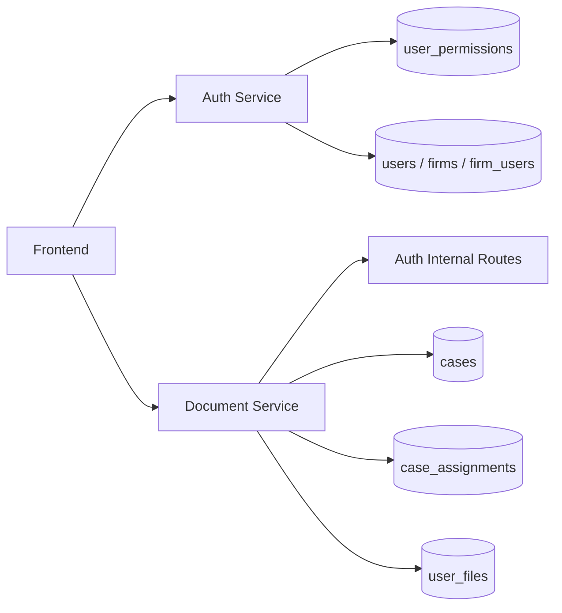
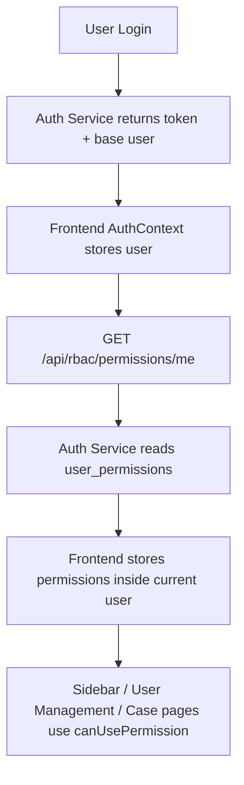
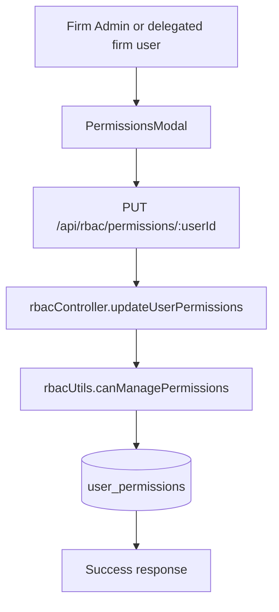
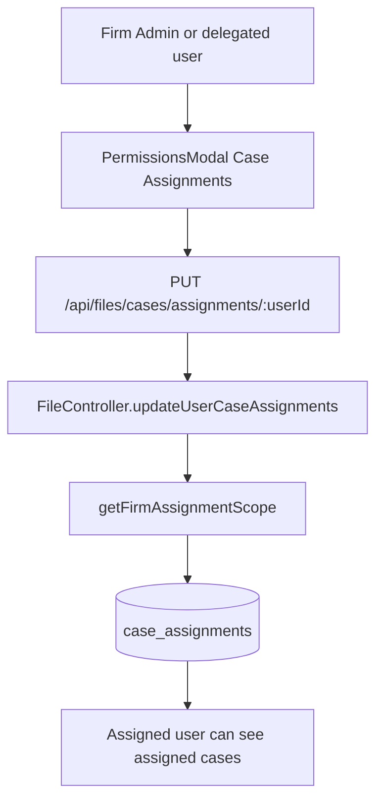
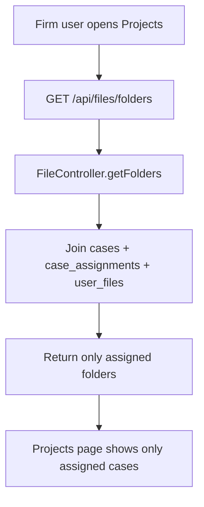

# RBAC Documentation

database tables and case assignments
When a firm admin gives a permission, it is stored in the database.

Main storage:

<!-- Table: user_permissions -->
Column: permissions
Type: JSONB
Key used: user_id
Where this is defined:

rbacDb.js (line 3)
Where the save happens:

The frontend sends the update to PUT /api/rbac/permissions/:userId
Backend function updateUserPermissions writes it into user_permissions
rbacController.js (line 341)
The actual DB write is this logic:

insert/update one row per user in user_permissions
rbacController.js (line 395)
How it is read later:

Backend reads it using getPermissionsByUserId
rbacUtils.js (line 40)
Frontend note:

The frontend also fetches the current logged-in user’s permissions and keeps them in memory/localStorage for UI checks
but that is only a cache for display and button visibility
the real source of truth is still the DB table above
AuthContext.jsx (line 23)
One important extra point:

case assignment is not stored in user_permissions
case access assignment is stored separately in case_assignments
caseAssignmentsDb.js
So in short:

normal RBAC permissions: user_permissions.permissions
<!-- case-to-user assignment: case_assignments -->


## 1. What We Implemented

We implemented **Role Based Access Control (RBAC)** in a way that works across:

- the **auth service** (who can do what)
- the **document service** (which cases and folders a user can actually access)
- the **frontend** (which buttons, pages, and actions are visible)

This RBAC system is not only UI-based.  
The frontend hides actions for a better user experience, but the backend also checks permissions again before doing the real work.

That means:

- if a button is hidden in frontend, the user cannot normally click it
- if someone still calls the API manually, the backend will block it

This is the correct and secure way to implement RBAC.

---

## 2. Simple Explanation In Plain Words

In simple words, the RBAC system works like this:

1. A user logs in.
2. The frontend fetches that user’s permissions.
3. The frontend stores those permissions in the current user object.
4. The UI checks those permissions before showing buttons like:
   - Create User
   - Edit Permissions
   - Create Case
   - Delete Case
5. When the user clicks something, the backend checks again.
6. For **firm users**, case visibility is even stricter:
   - they must have the right permission
   - and the case must also be assigned to them

So for a **firm user**, seeing a case is controlled by **both**:

- permission rules
- case assignment rules

---

## 3. Roles Used In The System

### `SOLO`

A solo user is not restricted by firm-user RBAC logic.

### `FIRM_ADMIN`

The firm admin is the top-level manager inside a firm.  
The admin can:

- create firm users
- manage permissions
- assign cases
- resend create-password email
- delete firm users

### `FIRM_USER`

A firm user is the controlled user inside the firm.  
This user gets granular permissions from the admin, for example:

- `create_new_users`
- `manage_user_permissions`
- `view_case_information`
- `create_new_cases`
- `delete_firm_users`
- `resend_password_setup_email`

Some of these are normal allow/disable permissions.  
Some lifecycle permissions are **explicit-only**, meaning they are disabled unless the admin directly allows them.

---

## 4. Main Design Principles

### 4.1 Auth service is the source of truth for permissions

All granular permissions are stored in the **auth service** in the `user_permissions` table.

### 4.2 Document service enforces access to cases and folders

The document service does not trust the frontend.  
It calls the auth service internally to verify user permissions.

### 4.3 Frontend is only the first layer

The frontend improves user experience by hiding or disabling actions, but backend still validates everything.

### 4.4 Case access uses both permissions and assignment

For `FIRM_USER`, just having `view_case_information` is not enough.  
The user also needs the case to be assigned through `case_assignments`.

---

## 5. Database Objects Used

### `users`

Stores the main user record.

Important columns used by RBAC:

- `id`
- `email`
- `username`
- `account_type`
- `first_login`
- `is_active`

### `firms`

Stores the firm.

Important RBAC column:

- `admin_user_id`

This is how the system knows who the real firm admin is.

### `firm_users`

Stores firm membership.

This table connects:

- `firm_id`
- `user_id`
- `role`

### `user_permissions`

Stores granular permissions as JSONB.

Example:

```json
{
  "create_new_users": "Allowed",
  "manage_user_permissions": "Allowed",
  "view_case_information": "Disabled"
}
```

### `cases`

Stores case records.

Important columns used by RBAC:

- `id`
- `user_id`
- `folder_id`

### `case_assignments`

Stores which case is assigned to which firm user.

Important columns:

- `case_id`
- `user_id`
- `assigned_by`

### `user_files`

Stores folders/files.  
Projects page uses this table together with cases and assignments.

---

## 6. High Level Architecture



Meaning:

- **auth service** owns permission data
- **document service** owns case/folder access data
- **document service** asks **auth service** when it needs permission verification

---

## 7. End-To-End Data Flow

### 7.1 Login and Permission Hydration Flow



### 7.2 Permission Update Flow



### 7.3 Case Assignment Flow



### 7.4 Assigned Case Access Flow



---

## 8. Backend File Map And What Each File Does

## 8.1 Auth Service

### File: `Backend/authservice/index.js`

Purpose:

- starts auth service
- mounts RBAC routes at `/api/rbac`
- initializes the RBAC schema

Important logic:

- mounts `rbacRoutes`
- calls `initializeRbacSchema()`

### File: `Backend/authservice/src/Rbac_service/rbacDb.js`

Purpose:

- creates the `user_permissions` table if it does not already exist

Implemented logic:

- one row per user
- permissions stored as JSONB
- used as the main storage for granular permission rules

### File: `Backend/authservice/src/Rbac_service/rbacRoutes.js`

Purpose:

- defines RBAC API endpoints

Main routes:

- `POST /api/rbac/firm/staff`
- `GET /api/rbac/firm/staff`
- `POST /api/rbac/firm/staff/:userId/resend-password-setup`
- `DELETE /api/rbac/firm/staff/:userId`
- `GET /api/rbac/permissions/me`
- `GET /api/rbac/permissions/:userId`
- `PUT /api/rbac/permissions/:userId`

### File: `Backend/authservice/src/Rbac_service/rbacUtils.js`

Purpose:

- contains the main RBAC helper logic
- calculates effective capabilities for the current actor
- checks whether a user can read or update another user’s permissions

Implemented logic:

- normalizes permission JSON
- interprets `"Allowed"` / `"Disabled"`
- resolves firm scope
- verifies firm membership
- identifies real firm admin from DB
- calculates capability flags such as:
  - `canCreateUsers`
  - `canManageUserPermissions`
  - `canManageCaseAssignments`
  - `canDeleteFirmUsers`
  - `canResendPasswordSetupEmail`

Very important rule:

- `canManageCaseAssignments = canManageUserPermissions && canViewCaseInformation`

This means delegated firm users are allowed to manage case assignments only if both permissions are enabled.

### File: `Backend/authservice/src/Rbac_service/rbacController.js`

Purpose:

- handles all RBAC request actions

Implemented logic:

- create firm user
- list firm users
- fetch current user permissions
- fetch target user permissions
- update target user permissions
- resend create-password email
- delete firm user

Important logic inside this file:

- full-access permission map for firm admin
- permission update logging
- lifecycle target resolution for delete/resend actions
- prevention of self-delete and prevention of deleting the firm admin through lifecycle endpoints

### File: `Backend/authservice/src/routes/internalRoutes.js`

Purpose:

- provides internal service-to-service endpoints

RBAC-specific use:

- `GET /api/auth/internal/user/:userId/permissions`

Implemented logic:

- document service uses this endpoint to fetch permissions for backend enforcement

### File: `Backend/authservice/src/services/otpService.js`

Purpose:

- sends OTP and password-related emails

RBAC-related logic added here:

- create-password invitation email template
- correct frontend URL generation
- resend create-password email support

This is important because firm user creation is part of the overall RBAC lifecycle.

---

## 8.2 Document Service

### File: `Backend/document-service/index.js`

Purpose:

- starts document service
- initializes case assignment schema on service startup

Implemented logic:

- calls `initializeCaseAssignmentsSchema()`

### File: `Backend/document-service/utils/caseAssignmentsDb.js`

Purpose:

- creates and validates the `case_assignments` table
- automatically adapts to the real database column types

Implemented logic:

- detects SQL type of `cases.id`
- detects SQL type for user IDs using local tables
- creates `case_assignments`
- creates indexes
- recreates incompatible empty assignment table if needed

This file is important because we faced real schema mismatch issues between `uuid` and `integer`, so this logic makes the system dynamic instead of assuming one fixed DB type.

### File: `Backend/document-service/utils/rbac.js`

Purpose:

- enforces permissions inside document service

Implemented logic:

- fetches permissions from auth service internal route
- checks a specific permission key
- only strictly enforces granular RBAC for `FIRM_USER`
- allows `FIRM_ADMIN` and `SOLO` users through normal document flow

### File: `Backend/document-service/routes/fileRoutes.js`

Purpose:

- exposes case and folder related endpoints

RBAC-related routes:

- `POST /api/files/create`
- `GET /api/files/cases`
- `GET /api/files/cases/:caseId`
- `PUT /api/files/cases/:caseId`
- `DELETE /api/files/cases/:caseId`
- `GET /api/files/folders`
- `GET /api/files/cases/assignable`
- `GET /api/files/cases/assignments/:userId`
- `PUT /api/files/cases/assignments/:userId`

### File: `Backend/document-service/controllers/FileController.js`

Purpose:

- this is the main RBAC enforcement file for case access

Implemented logic:

- create case permission enforcement
- view case permission enforcement
- update case permission enforcement
- delete case permission enforcement
- assignment-based case visibility
- assignment-based folder visibility
- case assignment CRUD
- self-assignment when firm user creates a case

This is the most important backend file for case access.

---

## 9. Frontend File Map And What Each File Does

### File: `frontend/src/context/AuthContext.jsx`

Purpose:

- stores logged-in user state
- fetches current user permissions after login

Implemented logic:

- calls `GET /api/rbac/permissions/me`
- attaches permissions to the current user object
- stores them in local storage

### File: `frontend/src/utils/permissions.js`

Purpose:

- shared frontend permission helpers

Implemented logic:

- central list of permission keys
- detects current account type
- decides whether RBAC should be enforced
- provides:
  - `canUsePermission`
  - `canUseAnyPermission`

### File: `frontend/src/components/Rbac_pages/rbacApi.js`

Purpose:

- all frontend API calls for RBAC

Implemented logic:

- fetch firm users
- create firm user
- resend password setup email
- delete firm user
- update user permissions
- fetch assignable cases
- fetch user case assignments
- update user case assignments

### File: `frontend/src/components/Sidebar.jsx`

Purpose:

- shows or hides sidebar items based on RBAC

Implemented logic:

- `Create New Case` button checks `create_new_cases`
- `User Management` appears for firm members

### File: `frontend/src/components/Rbac_pages/UserManagementTable.jsx`

Purpose:

- main User Management table

Implemented logic:

- fetches firm directory
- determines read-only vs editable mode
- opens permissions modal
- allows resend/delete actions based on dynamic capabilities
- passes `canManageCaseAssignments` into the modal

### File: `frontend/src/components/Rbac_pages/PermissionsModal.jsx`

Purpose:

- edit or view permissions for a selected user

Implemented logic:

- displays permission categories
- loads assignable cases
- loads selected user case assignments
- saves permissions and case assignments together
- supports read-only mode
- includes the `FIRM_USER` permission block

### File: `frontend/src/components/Rbac_pages/AddUserModal.jsx`

Purpose:

- create firm users from UI

Implemented logic:

- calls create-firm-user API
- shows success/warning depending on whether invite email was sent

### File: `frontend/src/pages/UserManagementPage.jsx`

Purpose:

- top-level page container for user management

Implemented logic:

- shows explanation text for admin vs firm user
- renders User Management table

### File: `frontend/src/pages/DocumentUploadPage.jsx`

Purpose:

- Projects / Documents view where case creation starts

Implemented logic:

- checks `create_new_cases`
- blocks case flow for users without create-case permission

### File: `frontend/src/pages/CreateCase/steps/ReviewStep.jsx`

Purpose:

- final create-case confirmation step

Implemented logic:

- checks `create_new_cases` before submitting case creation

### File: `frontend/src/pages/CaseDetailsPage.jsx`

Purpose:

- case details screen

Implemented logic:

- checks `edit_case_information`
- checks `delete_cases`
- hides edit/delete actions when permission is not allowed

### File: `frontend/src/components/DashboardComponents/CaseDetailView.jsx`

Purpose:

- alternate case details/editor component

Implemented logic:

- blocks save if `edit_case_information` is not allowed

---

## 10. Special Focus: Case Access Logic

This is the most important part of the RBAC system.

For `FIRM_USER`, **case access is not based only on user_id ownership**.  
It is based on **assignment**.

That means:

- if a case is not assigned, the firm user should not see it
- if the case is assigned, the firm user should see it in:
  - Projects
  - case list
  - case details
  - assigned folder/document views

### 10.1 Rule Summary

#### Firm Admin

- can see all firm cases
- can assign cases
- can manage case assignments

#### Delegated Firm User

- can manage case assignments only if:
  - `manage_user_permissions = Allowed`
  - `view_case_information = Allowed`

#### Normal Firm User

- can only see assigned cases

---

## 11. Case Access Logic Snippets

Below are the most important snippets that explain how case access works.

### Snippet A: Capability rule for managing case assignments

**File:** `Backend/authservice/src/Rbac_service/rbacUtils.js`

```js
const canManageUserPermissions = isPermissionAllowed(permissions, FIRM_PERMISSION_KEYS.MANAGE_USER_PERMISSIONS);
const canViewCaseInformation = isPermissionAllowed(permissions, FIRM_PERMISSION_KEYS.VIEW_CASE_INFORMATION);

return {
  ...
  canManageUserPermissions,
  canViewCaseInformation,
  canManageCaseAssignments: canManageUserPermissions && canViewCaseInformation,
  ...
};
```

What this means:

- a delegated firm user cannot manage case assignment just because `manage_user_permissions` is enabled
- they also need case visibility permission

---

### Snippet B: Backend permission enforcement for creating a case

**File:** `Backend/document-service/controllers/FileController.js`

```js
const permissionCheck = await ensureUserPermission(
  req,
  "create_new_cases",
  "You do not have permission to create new cases."
);
if (!permissionCheck.allowed) {
  return res.status(permissionCheck.status).json({ error: permissionCheck.message });
}
```

What this means:

- even if frontend shows or hides the create button, backend still checks
- firm users without `create_new_cases` cannot create a case by calling API directly

---

### Snippet C: Self-assignment when a firm user creates a case

**File:** `Backend/document-service/controllers/FileController.js`

```js
if (accountType === 'FIRM_USER') {
  ...
  await client.query(
    `
      INSERT INTO case_assignments (case_id, user_id, assigned_by)
      VALUES ($1::${assignmentMeta.caseIdSqlType}, $2::int, $3::int)
      ON CONFLICT (case_id, user_id) DO NOTHING
    `,
    [newCase.id, userIdInt, userIdInt]
  );
}
```

What this means:

- if a firm user is allowed to create a case, the system automatically assigns that case to that user
- this prevents the problem where the user creates the case but cannot see it later

---

### Snippet D: Firm user case details are assignment-based

**File:** `Backend/document-service/controllers/FileController.js`

```sql
SELECT *
FROM cases c
WHERE c.id = $1
  AND EXISTS (
    SELECT 1
    FROM case_assignments ca
    WHERE ca.case_id = c.id
      AND ca.user_id::text = $2::text
  );
```

What this means:

- for `FIRM_USER`, opening a case depends on assignment
- not just on direct ownership

---

### Snippet E: Projects page folder visibility is assignment-based

**File:** `Backend/document-service/controllers/FileController.js`

```sql
SELECT DISTINCT
  uf.*,
  c.case_title
FROM user_files uf
INNER JOIN cases c ON uf.id = c.folder_id
INNER JOIN case_assignments ca
  ON ca.case_id = c.id
 AND ca.user_id::text = $1::text
WHERE uf.is_folder = true
ORDER BY uf.created_at DESC
```

What this means:

- Projects page only returns folders for cases assigned to that firm user
- if admin removes assignment, the folder disappears from Projects

---

### Snippet F: Assignment update replaces old assignments with new selection

**File:** `Backend/document-service/controllers/FileController.js`

```js
await client.query('DELETE FROM case_assignments WHERE user_id = $1', [targetUserId]);

if (requestedCaseIds.length > 0) {
  await client.query(
    `
      INSERT INTO case_assignments (case_id, user_id, assigned_by)
      VALUES ${placeholders.join(', ')}
      ON CONFLICT (case_id, user_id) DO NOTHING
    `,
    values
  );
}
```

What this means:

- save action works as a full replace
- old case assignments are removed
- new selected cases are inserted

---

## 12. How Permission Update Works

### Backend flow

1. Frontend sends `PUT /api/rbac/permissions/:userId`
2. `rbacController.updateUserPermissions` receives request
3. `rbacUtils.canManagePermissions` checks:
   - is actor in same firm
   - is actor firm admin or delegated manager
   - is target in same firm
   - delegated manager cannot manage firm admin
4. permissions are stored in `user_permissions`

### Important file locations

- `Backend/authservice/src/Rbac_service/rbacController.js`
- `Backend/authservice/src/Rbac_service/rbacUtils.js`
- `Backend/authservice/src/Rbac_service/rbacDb.js`

---

## 13. How Current User Permissions Reach The Frontend

### Flow

1. User logs in
2. `AuthContext.jsx` stores the token and base user
3. `AuthContext.jsx` calls `GET /api/rbac/permissions/me`
4. Auth service returns permission JSON
5. Frontend stores permissions inside `user.permissions`
6. UI components call `canUsePermission(user, key)`

### Important file locations

- `frontend/src/context/AuthContext.jsx`
- `frontend/src/utils/permissions.js`

---

## 14. How Firm User Creation Works

### Flow

1. Admin opens Add User modal
2. Frontend sends `POST /api/rbac/firm/staff`
3. `rbacController.createFirmUser`:
   - checks actor capability
   - creates user in `users`
   - creates link in `firm_users`
   - inserts default permissions in `user_permissions`
   - sends create-password email
4. User receives password setup link

### Important file locations

- `frontend/src/components/Rbac_pages/AddUserModal.jsx`
- `frontend/src/components/Rbac_pages/rbacApi.js`
- `Backend/authservice/src/Rbac_service/rbacController.js`
- `Backend/authservice/src/services/otpService.js`

---

## 15. How Delete And Resend Lifecycle Permissions Work

We added a separate `FIRM_USER` permission block for lifecycle actions.

These are:

- `delete_firm_users`
- `resend_password_setup_email`

These are handled differently from normal permissions.

### Important detail

These are **explicit-only permissions**.

That means:

- if the key is missing, it is treated as **not allowed**
- admin must actively set it to `"Allowed"`

This logic is implemented in:

- `Backend/authservice/src/Rbac_service/rbacUtils.js`

---

## 16. Why We Need Both Frontend And Backend Checks

If we only checked permissions in frontend:

- a user could still call the API directly
- hidden buttons would not be enough for security

If we only checked permissions in backend:

- security would still work
- but the user experience would be poor because users would see actions they cannot use

So we use both:

- **frontend** for visibility and usability
- **backend** for real security

---

## 17. Summary Of Files Changed For RBAC

## Backend Auth Service

- `Backend/authservice/index.js`
- `Backend/authservice/src/Rbac_service/rbacDb.js`
- `Backend/authservice/src/Rbac_service/rbacRoutes.js`
- `Backend/authservice/src/Rbac_service/rbacUtils.js`
- `Backend/authservice/src/Rbac_service/rbacController.js`
- `Backend/authservice/src/routes/internalRoutes.js`
- `Backend/authservice/src/services/otpService.js`

## Backend Document Service

- `Backend/document-service/index.js`
- `Backend/document-service/utils/rbac.js`
- `Backend/document-service/utils/caseAssignmentsDb.js`
- `Backend/document-service/routes/fileRoutes.js`
- `Backend/document-service/controllers/FileController.js`

## Frontend

- `frontend/src/context/AuthContext.jsx`
- `frontend/src/utils/permissions.js`
- `frontend/src/components/Rbac_pages/rbacApi.js`
- `frontend/src/components/Sidebar.jsx`
- `frontend/src/components/Rbac_pages/UserManagementTable.jsx`
- `frontend/src/components/Rbac_pages/PermissionsModal.jsx`
- `frontend/src/components/Rbac_pages/AddUserModal.jsx`
- `frontend/src/pages/UserManagementPage.jsx`
- `frontend/src/pages/DocumentUploadPage.jsx`
- `frontend/src/pages/CreateCase/steps/ReviewStep.jsx`
- `frontend/src/pages/CaseDetailsPage.jsx`
- `frontend/src/components/DashboardComponents/CaseDetailView.jsx`

---

## 18. API Endpoint Reference

This section documents the main RBAC-related API endpoints, the function that handles them, what input they accept, and what output they return.

Common note:

- most of these APIs require `Authorization: Bearer <token>`
- internal APIs are service-to-service endpoints

---

### 18.1 Auth Service RBAC APIs

### `POST /api/rbac/firm/staff`

- **Handler function:** `createFirmUser`
- **File:** `Backend/authservice/src/Rbac_service/rbacController.js`
- **Route file:** `Backend/authservice/src/Rbac_service/rbacRoutes.js`
- **Purpose:** creates a new firm user and sends a create-password email

**Input body**

```json
{
  "fullName": "John Doe",
  "email": "john@example.com",
  "permissions": {
    "create_new_users": "Disabled",
    "view_user_information": "Allowed"
  }
}
```

**Important logic used**

- `getFirmUserCapabilities(req.user)`
- `normalizePermissions(...)`
- `sendCreatePasswordEmail(...)`

**Success output**

```json
{
  "success": true,
  "message": "Firm user created. Create-password email sent.",
  "emailSent": true,
  "user": {
    "id": 66,
    "username": "John Doe",
    "email": "john@example.com"
  }
}
```

**Possible error output**

```json
{
  "success": false,
  "message": "You do not have permission to add users."
}
```

---

### `GET /api/rbac/firm/staff`

- **Handler function:** `getFirmUsers`
- **File:** `Backend/authservice/src/Rbac_service/rbacController.js`
- **Route file:** `Backend/authservice/src/Rbac_service/rbacRoutes.js`
- **Purpose:** returns the user directory for User Management

**Input**

- no request body
- actor comes from JWT token

**Important logic used**

- `getFirmUserCapabilities(req.user)`
- admin query or member query depending on actor role
- returns dynamic `capabilities`
- returns dynamic `viewerMode`

**Success output**

```json
{
  "success": true,
  "users": [
    {
      "id": 66,
      "username": "jon cina",
      "email": "keliryho@fxzig.com",
      "first_login": false,
      "is_active": true,
      "account_type": "FIRM_USER",
      "membership_role": "STAFF",
      "permissions": {
        "create_new_users": "Allowed",
        "manage_user_permissions": "Allowed"
      },
      "is_self": false,
      "is_firm_admin": false
    }
  ],
  "capabilities": {
    "firmId": 12,
    "isFirmAdmin": true,
    "canCreateUsers": true,
    "canManageUserPermissions": true,
    "canManageCaseAssignments": true
  },
  "viewerMode": "admin"
}
```

**Important response fields**

- `users[]`: rows shown in User Management
- `capabilities`: what the current actor can do
- `viewerMode`: tells frontend whether table is editable or read-only

---

### `POST /api/rbac/firm/staff/:userId/resend-password-setup`

- **Handler function:** `resendFirmUserPasswordSetupEmail`
- **File:** `Backend/authservice/src/Rbac_service/rbacController.js`
- **Route file:** `Backend/authservice/src/Rbac_service/rbacRoutes.js`
- **Purpose:** resends create-password email to a pending firm user

**Input**

- path param: `userId`
- empty body

**Important logic used**

- `resolveFirmLifecycleTarget(req.user, userId, 'canResendPasswordSetupEmail')`
- `sendCreatePasswordEmail(...)`

**Success output**

```json
{
  "success": true,
  "message": "Create-password email resent successfully."
}
```

---

### `DELETE /api/rbac/firm/staff/:userId`

- **Handler function:** `deleteFirmUser`
- **File:** `Backend/authservice/src/Rbac_service/rbacController.js`
- **Route file:** `Backend/authservice/src/Rbac_service/rbacRoutes.js`
- **Purpose:** deletes a firm user from the firm

**Input**

- path param: `userId`

**Important logic used**

- `resolveFirmLifecycleTarget(req.user, userId, 'canDeleteFirmUsers')`
- transaction deletes related rows from:
  - `user_permissions`
  - `user_sessions`
  - `otps`
  - `firm_users`
  - `users`

**Success output**

```json
{
  "success": true,
  "message": "Firm user deleted successfully."
}
```

---

### `GET /api/rbac/permissions/me`

- **Handler function:** `getCurrentUserPermissions`
- **File:** `Backend/authservice/src/Rbac_service/rbacController.js`
- **Route file:** `Backend/authservice/src/Rbac_service/rbacRoutes.js`
- **Purpose:** returns current logged-in user permissions to the frontend

**Input**

- no body
- current user comes from token

**Success output**

```json
{
  "success": true,
  "permissions": {
    "create_new_cases": "Disabled",
    "view_case_information": "Allowed"
  }
}
```

**Used by**

- `frontend/src/context/AuthContext.jsx`

---

### `GET /api/rbac/permissions/:userId`

- **Handler function:** `getUserPermissions`
- **File:** `Backend/authservice/src/Rbac_service/rbacController.js`
- **Route file:** `Backend/authservice/src/Rbac_service/rbacRoutes.js`
- **Purpose:** returns permissions of a target user if the actor is allowed to read them

**Input**

- path param: `userId`

**Important logic used**

- `canReadPermissions(req.user, userId)`
- `getPermissionsByUserId(userId)`

**Success output**

```json
{
  "success": true,
  "permissions": {
    "create_new_users": "Allowed",
    "delete_users": "Disabled"
  }
}
```

---

### `PUT /api/rbac/permissions/:userId`

- **Handler function:** `updateUserPermissions`
- **File:** `Backend/authservice/src/Rbac_service/rbacController.js`
- **Route file:** `Backend/authservice/src/Rbac_service/rbacRoutes.js`
- **Purpose:** updates granular permissions for a target user

**Input body**

```json
{
  "permissions": {
    "create_new_users": "Allowed",
    "manage_user_permissions": "Allowed",
    "view_case_information": "Disabled"
  }
}
```

**Important logic used**

- `normalizePermissions(...)`
- `getFirmUserCapabilities(req.user)`
- `canManagePermissions(req.user, userId)`
- fallback firm membership check
- writes to `user_permissions`

**Success output**

```json
{
  "success": true,
  "message": "Permissions updated."
}
```

**Common forbidden output**

```json
{
  "success": false,
  "message": "Only the firm admin can update these permissions."
}
```

---

### 18.2 Internal Auth Service APIs

### `GET /api/auth/internal/user/:userId/permissions`

- **Handler function:** inline route handler
- **File:** `Backend/authservice/src/routes/internalRoutes.js`
- **Purpose:** document service uses this endpoint to fetch user permissions for backend enforcement

**Input**

- path param: `userId`

**Success output**

```json
{
  "permissions": {
    "create_new_cases": "Allowed",
    "view_case_information": "Disabled"
  }
}
```

**Used by function**

- `fetchUserPermissions(userId)`
- file: `Backend/document-service/utils/rbac.js`

---

### 18.3 Document Service RBAC-Relevant APIs

### `POST /api/files/create`

- **Handler function:** `createCase`
- **File:** `Backend/document-service/controllers/FileController.js`
- **Route file:** `Backend/document-service/routes/fileRoutes.js`
- **Purpose:** creates a new case and its case folder

**Input body**

Main important fields:

```json
{
  "case_title": "Pragati Seva Charitable Trust",
  "case_number": "123/2026",
  "filing_date": "2026-04-03",
  "case_type": "TRUSTS",
  "sub_type": "Charitable Trust Deed",
  "petitioners": [],
  "respondents": [],
  "status": "Active",
  "temp_folder_name": "draft-folder-name"
}
```

**Important logic used**

- `ensureUserPermission(req, 'create_new_cases', ...)`
- creates row in `cases`
- creates folder in `user_files`
- if actor is `FIRM_USER`, creates self-assignment in `case_assignments`

**Success output**

```json
{
  "message": "Case created successfully with folder",
  "case": {
    "id": 141,
    "user_id": 66,
    "case_title": "Pragati Seva Charitable Trust"
  },
  "folder": {
    "id": "uuid-folder-id",
    "originalname": "Pragati Seva Charitable Trust"
  }
}
```

---

### `GET /api/files/cases`

- **Handler function:** `getAllCases`
- **File:** `Backend/document-service/controllers/FileController.js`
- **Route file:** `Backend/document-service/routes/fileRoutes.js`
- **Purpose:** returns visible cases for the actor

**Input**

- no body
- current user comes from token

**Important logic used**

- `ensureUserPermission(req, 'view_case_information', ...)`
- for `FIRM_USER`: returns only cases joined through `case_assignments`
- for admin/solo: returns cases through allowed owner IDs

**Success output**

```json
{
  "message": "Cases fetched successfully.",
  "cases": [
    {
      "id": 141,
      "user_id": 65,
      "case_title": "Pragati Seva Charitable Trust",
      "status": "Active"
    }
  ],
  "totalCases": 1
}
```

---

### `GET /api/files/cases/:caseId`

- **Handler function:** `getCase`
- **File:** `Backend/document-service/controllers/FileController.js`
- **Route file:** `Backend/document-service/routes/fileRoutes.js`
- **Purpose:** returns one case if the actor is allowed to access it

**Input**

- path param: `caseId`

**Important logic used**

- `ensureUserPermission(req, 'view_case_information', ...)`
- for `FIRM_USER`: checks `EXISTS` in `case_assignments`
- also loads linked folder information

**Success output**

```json
{
  "message": "Case fetched successfully.",
  "case": {
    "id": 141,
    "case_title": "Pragati Seva Charitable Trust",
    "user_id": 65,
    "folders": [
      {
        "id": "uuid-folder-id",
        "name": "Pragati Seva Charitable Trust",
        "folder_path": "65/cases/Pragati-Seva-Charitable-Trust"
      }
    ]
  }
}
```

---

### `PUT /api/files/cases/:caseId`

- **Handler function:** `updateCase`
- **File:** `Backend/document-service/controllers/FileController.js`
- **Route file:** `Backend/document-service/routes/fileRoutes.js`
- **Purpose:** updates one case if the actor can edit it

**Input body**

Only send the fields to update, for example:

```json
{
  "case_title": "Updated Case Title",
  "status": "Closed"
}
```

**Important logic used**

- `ensureUserPermission(req, 'edit_case_information', ...)`
- `findAccessibleCaseOwnership(req, caseId)`

**Success output**

```json
{
  "message": "Case updated successfully.",
  "case": {
    "id": 141,
    "case_title": "Updated Case Title",
    "status": "Closed"
  }
}
```

---

### `DELETE /api/files/cases/:caseId`

- **Handler function:** `deleteCase`
- **File:** `Backend/document-service/controllers/FileController.js`
- **Route file:** `Backend/document-service/routes/fileRoutes.js`
- **Purpose:** deletes a case and its folder if the actor can delete it

**Input**

- path param: `caseId`

**Important logic used**

- `ensureUserPermission(req, 'delete_cases', ...)`
- `findAccessibleCaseOwnership(req, caseId)`
- deletes folder and GCS files

**Success output**

```json
{
  "message": "Case and associated folder deleted successfully.",
  "deletedCase": {
    "id": 141
  }
}
```

---

### `GET /api/files/folders`

- **Handler function:** `getFolders`
- **File:** `Backend/document-service/controllers/FileController.js`
- **Route file:** `Backend/document-service/routes/fileRoutes.js`
- **Purpose:** returns folders shown in Projects

**Input**

- no body

**Important logic used**

- for `FIRM_USER`, joins:
  - `user_files`
  - `cases`
  - `case_assignments`
- only assigned case folders are returned

**Success output**

```json
{
  "folders": [
    {
      "id": "uuid-folder-id",
      "name": "Pragati Seva Charitable Trust",
      "case_title": "Pragati Seva Charitable Trust",
      "folder_path": "65/cases/Pragati-Seva-Charitable-Trust",
      "gcs_path": "65/cases/Pragati-Seva-Charitable-Trust/",
      "created_at": "2026-04-03T10:00:00.000Z",
      "children": []
    }
  ]
}
```

---

### `GET /api/files/cases/assignable`

- **Handler function:** `getAssignableCases`
- **File:** `Backend/document-service/controllers/FileController.js`
- **Route file:** `Backend/document-service/routes/fileRoutes.js`
- **Purpose:** returns firm cases that can be assigned in the permissions modal

**Input**

- no body

**Important logic used**

- `initializeCaseAssignmentsSchema(...)`
- `getFirmAssignmentScope(req)`
- requires `scope.canManageAssignments`

**Success output**

```json
{
  "cases": [
    {
      "id": 141,
      "user_id": 65,
      "case_title": "Pragati Seva Charitable Trust",
      "case_number": "123/2026",
      "status": "Active",
      "assigned_user_ids": [66]
    }
  ]
}
```

---

### `GET /api/files/cases/assignments/:userId`

- **Handler function:** `getUserCaseAssignments`
- **File:** `Backend/document-service/controllers/FileController.js`
- **Route file:** `Backend/document-service/routes/fileRoutes.js`
- **Purpose:** returns which case IDs are assigned to the target user

**Input**

- path param: `userId`

**Important logic used**

- `initializeCaseAssignmentsSchema(...)`
- `getFirmAssignmentScope(req)`
- target user must belong to same firm

**Success output**

```json
{
  "userId": 66,
  "caseIds": [141, 145]
}
```

---

### `PUT /api/files/cases/assignments/:userId`

- **Handler function:** `updateUserCaseAssignments`
- **File:** `Backend/document-service/controllers/FileController.js`
- **Route file:** `Backend/document-service/routes/fileRoutes.js`
- **Purpose:** saves the selected case assignments for a target user

**Input body**

```json
{
  "caseIds": [141, 145]
}
```

**Important logic used**

- `initializeCaseAssignmentsSchema(...)`
- `getFirmAssignmentScope(req)`
- validates that requested cases belong to the same firm
- deletes old assignments
- inserts new assignments

**Success output**

```json
{
  "success": true,
  "message": "Case assignments updated successfully.",
  "userId": 66,
  "caseIds": [141, 145]
}
```

---

### 18.4 Frontend Functions That Call These APIs

### File: `frontend/src/components/Rbac_pages/rbacApi.js`

Frontend API wrapper functions:

- `fetchFirmUsers()`
- `createFirmUser(userData)`
- `resendFirmUserPasswordSetupEmail(userId)`
- `deleteFirmUser(userId)`
- `updateUserPermissions(userId, permissions)`
- `fetchAssignableCases()`
- `fetchUserCaseAssignments(userId)`
- `updateUserCaseAssignments(userId, caseIds)`

These functions are used by:

- `AddUserModal.jsx`
- `UserManagementTable.jsx`
- `PermissionsModal.jsx`

### File: `frontend/src/context/AuthContext.jsx`

Frontend permission hydration functions:

- `fetchCurrentUserPermissions(authToken)`
- `hydratePermissions(authToken, baseUser)`

These functions call:

- `GET /api/rbac/permissions/me`

and attach the permission JSON into the current user object for the rest of the frontend.

---

## 19. Final Understanding

This RBAC implementation is a **hybrid permission + assignment system**.

The most important ideas are:

- permissions are stored in auth service
- permissions are hydrated into frontend after login
- frontend uses those permissions to control the UI
- backend re-checks permissions for security
- document service uses assignment-based visibility for cases
- firm users only see assigned cases
- delegated firm users can manage others only if their permissions allow it

This gives us:

- security
- flexibility
- good user experience
- clean separation between permission management and case data access
